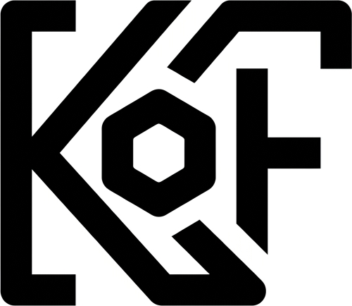

# Kof

<p align="center">
  
</p>

### Uma linguagem. Um compilador. Vários mundos.
se pronuncia coffe

**Menos código. Mais intenção. JVM, nativo, script e web. Tudo partindo da mesma linguagem.**

---

> Algumas pessoas olham para um problema e escrevem uma biblioteca.
>
> Outras escrevem um framework.
>
> Algumas criam uma ferramenta.
>
> Eu aparentemente olhei para o ecossistema inteiro e pensei:
>
> **"Tá tudo complicado demais. Vou criar uma linguagem."**
>
> E, aparentemente, uma linguagem só também não era suficiente.

Bem-vinda à **Kof**.

---

# O que é Kof?

Kof é uma linguagem de programação **geral, fortemente tipada e estaticamente tipada**, construída com uma ideia central:

> **Uma única linguagem não deveria obrigar você a escolher um único mundo.**

Kof possui seu próprio compilador, lexer, parser, sistema de tipos, análise semântica e representação intermediária.

A partir dessa representação, diferentes backends podem transformar o mesmo programa em diferentes formas de execução.

```text
                         KOF
                          │
                    Kof Compiler
                          │
                       Kof IR
                          │
          ┌───────────────┼────────────────┐
          │               │                │
       Kof4J          KofNative        KofScript
          │               │                │
          ▼               ▼                ▼
        JVM          Native Binary      Runtime
       .class        Executável        Interativo
          │               │                │
          ▼               ▼                ▼
        JVM             OS/CPU        Kof Runtime
                          │
                          ▼
                        KofJS
                          │
                          ▼
                         Web
```

---

# O que é Kof?

Kof é uma linguagem de programação **geral, fortemente tipada e estaticamente tipada**.

Uma linguagem. Um compilador. Múltiplos targets.

```text
Kof Source
    │
    ▼
Kof Compiler
    │
    ▼
Kof IR
    │
    ├──────────► Kof4J ───────► JVM
    │
    ├──────────► KofNative ───► Executável nativo
    │
    ├──────────► KofScript ───► Runtime
    │
    └──────────► KofJS ───────► Web
```

**A linguagem não muda. O target muda.**

---

# Kof não é um transpiler

Kof não funciona assim:

```text
Kof → Java → javac → JVM
```

Funciona assim:

```text
Kof → Kof Compiler → Kof IR → Backend → Target
```

O compilador possui sua própria implementação de:

* lexer
* parser
* AST
* resolução de símbolos
* sistema de tipos
* análise semântica
* IR
* diagnostics
* geração de código

Kof não depende de Java como linguagem intermediária.

---

# Estado Atual

Kof está em desenvolvimento ativo — **Alpha 0.0.5** (`0.0.5-alpha`).

O compilador possui frontend próprio, type system, Kof IR e três backends.

| Feature | JVM | Native | KofJS |
|---------|-----|--------|-------|
| println | ✅ | ✅ | ✅ |
| variables | ✅ | ✅ | ✅ |
| arithmetic | ✅ | ✅ | ✅ |
| if/else, if-expr | ✅ | ✅ | ✅ |
| while, for, do-while, for-in | ✅ | ✅ | ✅ |
| switch | ✅ | ✅ | ✅ |
| functions (sem `fun`) | ✅ | ✅ | ✅ |
| records | ✅ | ✅ | ✅ |
| classes | ✅ | ✅ | ✅ |
| constructors (`constructor(...)` + primary) | ✅ | ✅ | ✅ |
| inheritance, interfaces, virtual dispatch | ✅ | ✅ | ✅ |
| generics (erasure) | ✅ | ✅ | ✅ |
| lambdas | ✅ | ✅ | ✅ |
| exceptions (try/catch/finally) | ✅ | ✅ | ✅ |
| assert | ✅ | ✅ | ✅ |
| spawn (concorrência) | ✅ | CONC001 | — |
| strings (concat `+`, `==`, API completa) | ✅ | ✅ | ✅ |
| arrays | ✅ | ✅ | ✅ |
| List\<T\>, listOf | ✅ | ✅ | ✅ |
| JSON encode/decode (objetos no JVM) | ✅ | ✅ | ✅ |
| kof.io (File, Path, Directory) | ✅ | ✅ | ✅ |
| kof.time (`now()`) | ✅ | ✅ | ✅ |

**KofJS** (target `js`): o mesmo frontend e a mesma Kof IR geram ES Modules
(ECMAScript 2022+) executados na engine JS embarcada (GraalJS — sem Node.js
nem runtime externo). `kof build --target js` / `kof run --target js`.
Status alpha: [docs/targets/KOFJS.md](docs/targets/KOFJS.md).

**Concorrência**: `spawn tarefa()` / `spawn { ... }` — virtual threads na JVM,
join implícito; Native reporta `CONC001` (gap documentado). Ver
[docs/concurrency.md](docs/concurrency.md).

**Testes**: `assert(cond, "msg")` + `kof test <file.kf|dir>` — PASS/FAIL por
exit code. Ver [learn/23-testing.md](learn/23-testing.md).

---

# kof.io — Filesystem

Arquivos, diretórios e caminhos com uma API única em todos os targets:

```kof
var path = Path("data/users.txt")
path.parent().createDirectories()
path.writeText("Mel\nKof\n")
println(path.readText())
println(path.size())
```

```kof
var dir = Directory("data")
dir.createDirectories()
for (var entry in dir.list()) {
    println(entry.name)
}
```

Texto sempre UTF-8; bytes como `Int[]`; erros consistentes (Bool/`null`).
Ver: [learn/34-file-system.md](learn/34-file-system.md) e
[docs/stdlib/IO.md](docs/stdlib/IO.md).

---

# Instalação

Kof é uma **distribuição**: instale e receba compilador, CLI, runtime,
stdlib, tooling, editor support e um OpenJDK embutido. **Nenhuma instalação
externa de Java é necessária.**

```bash
# Baixe o artefato do GitHub Releases e extraia:
tar -xzf kof-0.0.5-alpha-linux-x86_64.tar.gz
export PATH="$PWD/kof-0.0.5-alpha-linux-x86_64/bin:$PATH"

kof version        # kof 0.0.5-alpha
kof info           # ambiente completo (JVM embutida, Tooling API 21, targets)
```

Ver: [docs/distribution/INSTALL.md](docs/distribution/INSTALL.md) e
[docs/distribution/ARCHITECTURE.md](docs/distribution/ARCHITECTURE.md).

---

# CLI

```bash
kof build <dir> [--target jvm|native|js] [--output <dir>]
kof run <file.kf> [--target jvm|native|js] [args...]
kof serve <file.kf> [--port <port>] [--host <host>]
kof check <file.kf|dir>
kof test <file.kf|dir> [--target jvm|native]
kof info [--json]
kof lsp
kof install <dir>
kof version
```

`kof fmt` é planejado (ver [docs/tooling/README.md](docs/tooling/README.md)).

---

# Construindo

```bash
mvn clean package -DskipTests
bin/kof info
```

Versionamento centralizado em `VERSION` — ver
[docs/distribution/VERSIONING.md](docs/distribution/VERSIONING.md).

---

# Arquitetura

```text
Source (.kf)
  ↓ Lexer
  ↓ Parser
  ↓ AST
  ↓ Type System
  ↓ Semantic Analysis
  ↓ Kof IR (backend-agnostic)
  ├── JVM Backend (ASM)
  └── Native Backend (x86-64)
```

---

# Princípios

1. Menos código, mesma capacidade
2. Tipagem forte
3. Intenção acima de cerimônia
4. Um frontend, múltiplos backends
5. Direto para o target
6. Interoperabilidade
7. Sem mágica desnecessária
8. Ferramentas importam

---

# O que Kof NÃO é

* Java com outra sintaxe.
* Kotlin 2.
* Julia para JVM.
* Um transpiler.
* Um gerador de Java.
* Um interpretador fantasiado de compilador.

Kof é uma linguagem. Um compilador. Uma IR. Vários backends.

---

# Licença

Kof é software livre distribuído sob a licença **GNU General Public License v3.0**.

Isso se aplica ao código-fonte do compilador, ferramentas e demais componentes do projeto.

**Programas escritos em Kof NÃO são automaticamente GPLv3.**

O autor do programa mantém o direito de escolher a licença do próprio software. Usar o compilador Kof não obriga ninguém a abrir seu código-fonte.

Software proprietário escrito em Kof é permitido, desde que respeite as licenças das dependências que efetivamente incorporar.

Para mais detalhes, consulte [docs/LICENSING.md](docs/LICENSING.md).

---

**Kof**

*Uma linguagem. Um compilador. Vários mundos.*

*Menos cerimônia. Mais intenção.*
